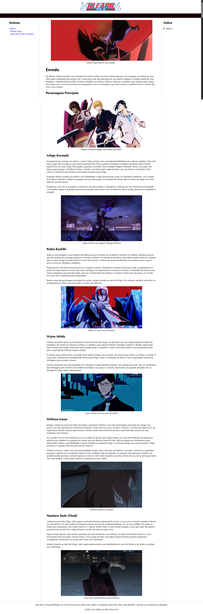
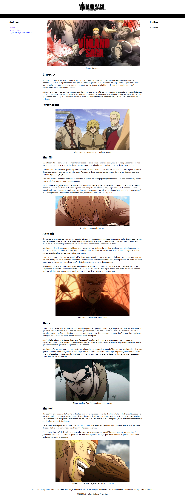
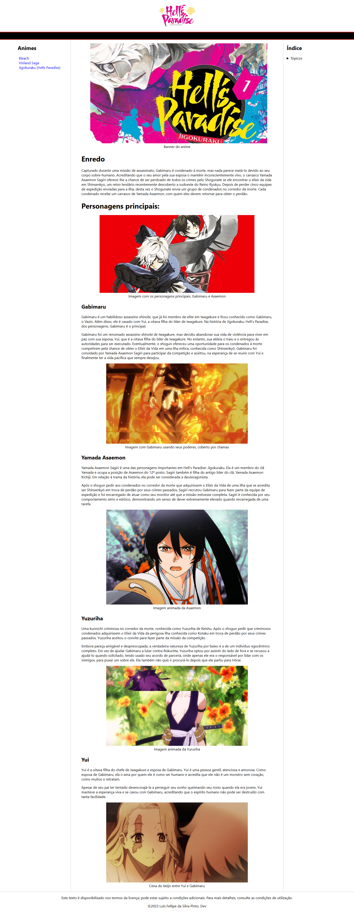

# AnimeverseClub Wiki

Projeto final do curso de **HTML** da [Dio.me](https://www.dio.me/), com o desafio de criar uma página estilo Wikipedia sobre um tema livre. Escolhi desenvolver o conteúdo com foco em três animes: **Bleach**, **Jigokuraku (Hell's Paradise)** e **Vinland Saga**.

O tema foi escolhido por afinidade pessoal, mas o foco técnico foi total: apliquei **boas práticas de HTML semântico e acessibilidade**, construindo um site organizado, navegável e informativo.

> 💡 *O CSS foi fornecido pelo instrutor. Todo o desenvolvimento do HTML, estrutura do conteúdo e aplicação de semântica e acessibilidade foi feito por mim.*

---

## 📌 Objetivos do Projeto

- Praticar o uso de **HTML semântico**;
- Aplicar conceitos de **acessibilidade**, usando elementos como `
`, `
`, `<figure>`, `<figcaption>`, entre outros;
- Criar um site **multi-páginas interligadas**, simulando o estilo da Wikipedia;
- Utilizar uma **estrutura de navegação clara e amigável**, com menu lateral e índice interno por página.

---

## 🧠 O que foi trabalhado

- Estruturação de **páginas temáticas individuais** para cada anime;
- Navegação entre páginas com links relativos e coerência na nomenclatura dos arquivos;
- Organização de conteúdo com foco em escaneabilidade e estrutura hierárquica de títulos;
- Uso de imagens com descrições acessíveis (`alt`) e legendas (`figcaption`);
- Navegação interna com **ancoragem por tópicos**.

---

## 🌐 Acesse o projeto

🔗 [Ver projeto publicado no GitHub Pages](https://luis-fellipe.github.io/enciclopedia-animes-html/)

---

## 📸 Prévia

### 🟠 Página: Bleach

### 🔵 Página: Vinland Saga

### 🟢 Página: Jigokuraku

---

## ✨ Considerações finais

Este projeto foi uma ótima oportunidade para aplicar, de forma prática, os conceitos fundamentais de **HTML moderno**, com foco em organização, clareza e acessibilidade. O conteúdo foi escolhido por afinidade, mas com abordagem estruturada e profissional.

---

🔗 [Veja meu LinkedIn](https://www.linkedin.com/in/luis-fellipe-real)

